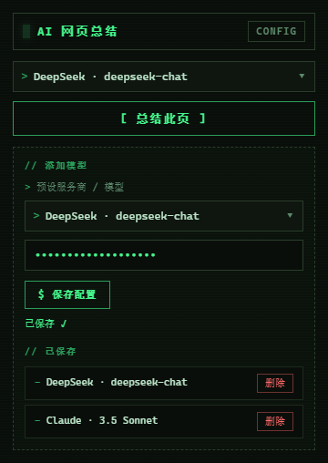
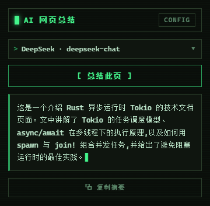
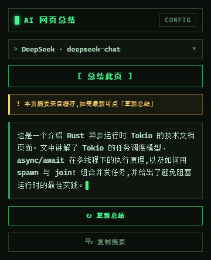
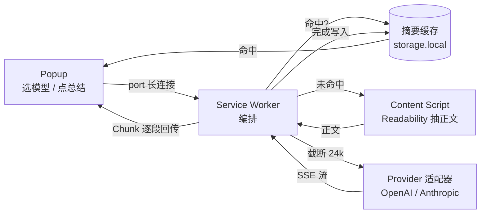

<div align="center">


# AI 网页总结

**用 AI 流式总结当前网页 —— 多模型、自带 Key、即用即走**

一个 Manifest V3 浏览器扩展。点一下，就把当前网页的正文抽出来，交给你自己配置的大模型，
边生成边显示一段约 150 字的精炼摘要。Key 只存在本地，正文只发往你指定的模型服务商。

<sub>TypeScript · Vite · @crxjs · Readability · zod · vitest</sub>

</div>

---

## ✨ 特性一览

| | 能力 | 说明 |
|---|---|---|
| ⚡ | **一键总结** | 用 Mozilla Readability 抽取正文（自动剥离导航 / 广告 / 评论），无需选中 |
| 🌊 | **流式输出** | SSE 边生成边显示，终端光标实时跳动，不用干等 |
| 🧩 | **多模型 / 多服务商** | 同时支持 OpenAI 接口格式与 Anthropic 接口格式，下拉随时切换 |
| 🔑 | **自带 Key** | 粘贴你自己的 API Key 即用，配置存在 `chrome.storage.local`，**不经任何第三方服务器** |
| 💾 | **结果缓存** | 同一页面 + 同一模型只总结一次，再次打开秒回；可一键「重新总结」强制刷新 |
| 🌐 | **语言自适应** | 输出语言以**正文实际文字**为准（中文页面误标 `lang="en"` 也不会被带偏） |
| ✂️ | **超长截断** | 正文超过 24000 字自动截断尾部并提示，保证请求稳定 |
| 🖥️ | **终端极客主题** | 黑底荧光绿 + 等宽字 + CRT 扫描线的命令行美学 |

---

## 🖼️ 最终效果

<table>
<tr>
<td width="33%" align="center"><b>① 配置模型</b></td>
<td width="33%" align="center"><b>② 流式摘要</b></td>
<td width="33%" align="center"><b>③ 命中缓存</b></td>
</tr>
<tr>
<td></td>
<td></td>
<td></td>
</tr>
<tr>
<td><sub>选预设、粘贴 Key、保存，可存多套</sub></td>
<td><sub>「这是一个……的页面」开头，约 150 字</sub></td>
<td><sub>来自缓存的提示 + 「重新总结」按钮</sub></td>
</tr>
</table>

---

## 🚀 使用方法

### 1. 构建扩展

```bash
cd ai-web-summary  # 扩展源码在此子目录
npm install
npm run build      # 产物输出到 dist/
```

> 开发时也可以用 `npm run dev`，crxjs 会启动带热更新的开发构建。

### 2. 加载到浏览器

1. 打开 `chrome://extensions`（Edge 为 `edge://extensions`）
2. 右上角打开 **开发者模式**
3. 点击 **加载已解压的扩展程序**，选择项目下的 **`dist/`** 目录
4. 浏览器工具栏出现 **AI 网页总结** 图标，点亮即装好

### 3. 配置模型（首次必做）

点击工具栏图标打开弹窗 → 右上角 **`CONFIG`** 展开「添加模型」：

1. 在 **预设服务商 / 模型** 下拉里选一个（见下表）
2. 把你的 **API Key** 粘到输入框
3. 点 **保存配置** —— 出现 `已保存 ✓` 即可

可以保存多套配置，顶部下拉随时切换；不需要的在「已保存」列表里点「删除」。

**内置预设：**

| 服务商 | 模型 | 接口格式 |
|---|---|---|
| DeepSeek | `deepseek-chat` / `deepseek-reasoner` | OpenAI |
| OpenAI | `GPT-4o` / `GPT-4o mini` | OpenAI |
| Claude | `3.5 Sonnet` / `3.5 Haiku` | Anthropic |

> 想用预设之外的模型 / 自建网关？打开**设置页**（`options`）可手填 `label`、接口格式、模型名、Key 和自定义 `baseURL`（留空走官方地址）。

### 4. 总结网页

打开任意文章页 → 点图标 → 点 **`[ 总结此页 ]`**：

- 摘要会**流式**逐字出现；
- 完成后可点 **复制摘要**；
- 同页同模型再次打开会直接返回缓存，并显示「重新总结」按钮供你强制刷新。

> ⚠️ `chrome://`、扩展页、纯 PDF 等无法注入内容脚本的页面不支持总结，会给出明确提示。

---

## 🧠 工作原理



1. **抽取** — content script 用 Readability 克隆 DOM 提取正文与页面语言，不改动真实页面；
2. **编排** — service worker 选中配置后先查缓存（URL 去锚点归一化 + `kind:model` 组键），命中直接回，未命中才抽正文；
3. **截断** — 正文超过 `MAX_INPUT_CHARS (24000)` 截断尾部并发 `Truncated` 提示；
4. **生成** — 按配置的接口格式选 OpenAI / Anthropic 适配器，拼好系统提示词后发起流式请求；
5. **回传** — 通过 port 把 `Chunk / Cached / Truncated / Done / Error` 消息流式送回弹窗渲染；
6. **缓存** — 成功后写入缓存（最多 100 条，超出按写入时间淘汰最旧）。

---

## 🔒 隐私

- **API Key 只保存在本地** `chrome.storage.local`，不上传、不经任何中间服务器。
- 网页正文**只发往你自己配置的模型服务商**（如 DeepSeek / OpenAI / Anthropic）。
- 扩展申请的权限：`activeTab`、`scripting`、`storage`，以及读取页面正文所需的 `host_permissions: <all_urls>`。

---

## 🛠️ 开发

```bash
npm run dev         # 开发构建 + 热更新
npm run build       # 生产构建到 dist/
npm run typecheck   # tsc --noEmit 类型检查
npm test            # vitest 单元测试
```

**项目结构：**

```
src/
├─ background/service-worker.ts   # 编排：缓存 / 抽取 / 截断 / 流式回传
├─ content/extract.ts             # Readability 正文抽取
├─ popup/                         # 弹窗 UI（终端主题）
├─ options/                       # 设置页（手填自定义模型）
├─ core/
│  ├─ providers/                  # openai / anthropic 适配器
│  ├─ presets.ts                  # 内置服务商·模型预设
│  ├─ prompt.ts                   # 系统提示词
│  ├─ sse.ts                      # SSE 流解析
│  ├─ truncate.ts                 # 正文截断
│  ├─ summary-cache.ts            # 摘要缓存（LRU 近似）
│  └─ storage.ts                  # 配置读写 + zod 校验
└─ shared/messages.ts             # 跨上下文消息协议
```

> 协作规范见 [`AGENTS.md`](ai-web-summary/AGENTS.md)：强制中文 JSDoc、状态用 TS `enum`、提交前统一跑 typecheck / test。

---

<div align="center"><sub>v0.1.0 · Manifest V3 · 仅供学习与个人使用</sub></div>
